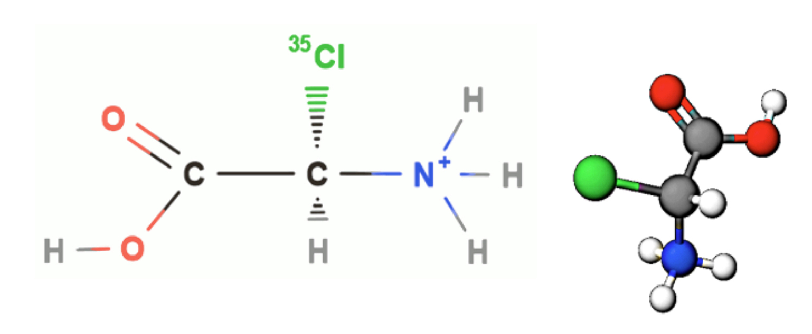
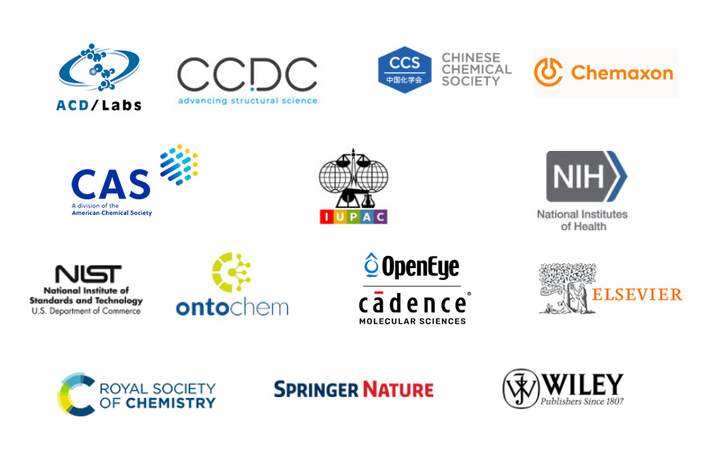

[](https://opensource.org/licenses/MIT)
[](https://github.com/IUPAC-InChI/InChI/graphs/commit-activity)
[](https://github.com/IUPAC-InChI/InChI/issues/)

[](https://github.com/IUPAC-InChI/InChI/actions/workflows/ci.yml)
[](https://github.com/IUPAC-InChI/InChI/actions/workflows/release.yml)
[](https://GitHub.com/IUPAC-InChI/InChI/graphs/contributors/)
[](https://github.com/IUPAC-InChI/InChI/releases/)
[](https://github.com/IUPAC-InChI/InChI/blob/v1.07.2/INCHI-1-DOC/CHANGELOG.md)
[](https://doi.org/10.1186/s13321-021-00517-z)
[](https://www.inchi-trust.org/inchi-overview-papers-presentations/?wpv_aux_current_post_id=4309&wpv_aux_parent_post_id=4309&wpv_view_count=4473)
[](https://iupac-inchi.github.io/InChI-Web-Demo/)


# **InChI** - The IUPAC International Chemical Identifier

**InChI** is a structure-based chemical identifier, developed by [IUPAC](https://iupac.org/) and the [InChI Trust](https://www.inchi-trust.org/). It is a standard identifier for chemical databases that facilitates effective information management across chemistry.

**InChI** and **InChIKey** are open standards. They use unique machine readable strings to represent, store and search chemical structures. All the software and algorithms related to them are open source.

## Contents of this document

- [**InChI** - The IUPAC International Chemical Identifier](#inchi---the-iupac-international-chemical-identifier)
  - [Contents of this document](#contents-of-this-document)
  - [What is InChI](#what-is-inchi)
  - [InChI Trust](#inchi-trust)
  - [How to contribute](#how-to-contribute)
  - [Contents of this repository](#contents-of-this-repository)
    - [INCHI-1-BIN](#inchi-1-bin)
    - [INCHI-1-DOC](#inchi-1-doc)
    - [INCHI-1-SRC](#inchi-1-src)
    - [INCHI-1-TEST](#inchi-1-test)
    - [INCHI-1-DOC/assets](#images)
  - [Using precompiled binaries](#using-precompiled-binaries)
  - [Compiling from source](#compiling-from-source)
      - [Known issues](#known-issues)
  - [Optional features](#optional-features)
  - [Experimental features under development](#experimental-features-under-development)

## What is InChI

**InChI** is a structure-based textual identifier, strictly unique, non-proprietary, open source, and freely accessible.

**InChI** identifiers describe chemical substances in terms of layers of information – the atoms and their bond connectivity, tautomeric information, isotope information, stereochemistry, and electronic charge.




With its fixed length of 27 characters the **InChIKey** — the hashed version of the **InChI** — allows for a compact representation and usage in databases or search engines.

**InChI** is used by most of the large chemical databases and software applications handling many millions of chemical structures.

**InChI** enables the linking and interlinking of chemistry and chemical structures on the web and computer platforms.  By enhancing the discoverability of chemical structures, **InChI** advances the [FAIR Guiding Principles for scientific data management and stewardship](https://doi.org/10.1038/sdata.2016.18). FAIR was published in 2016 to provide guidelines to improve the Findability, Accessibility, Interoperability, and Reuse of digital assets. **InChI** provides ‘Findability’ for chemical structures and extends Interoperability between platforms, both of which foster Accessibility and Reuse.

## InChI Trust

The [InChI Trust](https://www.inchi-trust.org/) is a charity that supports the development and promotion of the InChI standard. It works in partnership with [IUPAC](https://iupac.org/) to update and release new extensions to and applications of InChI. The Trust is a membership organisation, governed by its Board of Trustees which includes representation from [IUPAC](https://iupac.org/).



The scientific design of the various tools and capabilities that comprise the InChI code are defined by the InChI Working Groups which are made up of volunteers from the InChI community with [IUPAC](https://iupac.org/) oversight. These voluntary groups are each focused on specific areas of chemistry or tools within the InChI code. See [Working Groups](https://www.inchi-trust.org/inchi-working-groups/) for details on each group and their membership.

The development of the code is coordinated by the Technical Director of the InChI Trust, together with the working groups, [IUPAC](https://iupac.org/) and our development partners. Our development partners currently include [RWTH Aachen](https://www.rwth-aachen.de) (as part of [NFDI4Chem](https://www.nfdi4chem.de/), acknowledging funding from [Volkswagen Stiftung](https://www.volkswagenstiftung.de/de) and the [Data Literacy Alliance – DALIA](https://dalia.education/)), and the [Beilstein Institut](https://www.beilstein-institut.de/en/).


## How to contribute

Should you have any questions, comments, or suggestions, please feel free to post them here: [GitHub discussion page](https://github.com/IUPAC-InChI/InChI/discussions).

If you encounter a bug, we kindly request you to [create an issue](https://github.com/IUPAC-InChI/InChI/issues).

You are welcome to contribute to this project. To do so, you may [create a pull request](https://github.com/IUPAC-InChI/InChI/pulls).

## Contents of this repository

### INCHI-1-BIN

The [INCHI-1-BIN](https://github.com/IUPAC-InChI/InChI/tree/main/INCHI-1-BIN) subfolder contains binaries of the command line `InChI` executable (`inchi-1`) and the `InChI API` library (`libinchi`).

### INCHI-1-DOC

The [INCHI-1-DOC](https://github.com/IUPAC-InChI/InChI/tree/main/INCHI-1-DOC) subfolder contains documentation related to the InChI Software.

### INCHI-1-SRC

The [INCHI-1-SRC](https://github.com/IUPAC-InChI/InChI/tree/main/INCHI-1-SRC) subfolder contains the InChI source code. It also contains examples of InChI API usage, for C
(`inchi_main`, `mol2inchi`, `test_ixa`), as well as the InChI API library source code and
related projects/makefiles.

### INCHI-1-TEST

The [INCHI-1-TEST](https://github.com/IUPAC-InChI/InChI/tree/main/INCHI-1-TEST) subfolder contains the test scripts and resources.

## Using precompiled binaries

64-bit and 32-bit precompiled binaries (executable, `.dll/.so` and ELF files) are located in the following folders:
<br />
<table id="Win">
  <tr>
    <td colspan="3" align="center"><strong>Microsoft<sup>&reg;</sup> Windows</strong></td>
  </tr>
  <tr>
    <td>
      <strong>Files</strong> (given in compressed `.zip` format)
    </td>
    <td>
      <strong>Location(s)</strong>
    </td>
    <td>
      <strong>Compiler</strong>
    </td>
  </tr>
  <tc>
    <td rowspan="2">
      <code>inchi-1.exe</code>
    </td>
    <td>
      <em>64-bit</em>: <code>INCHI-1-BIN/windows/64bit</code>
    </td>
    <td>
      <code>Microsoft<sup>&reg;</sup> Visual Studio C++ (MSVC)</code>
    </td>
  </tr>
  <tr>
    <td>
      <em>32-bit</em>: <code>INCHI-1-BIN/windows/32bit</code>
    </td>
    <td>
      <code>MinGW-w64/Clang</code><sup><strong>(1)</strong></sup>
    </td>
  </tr>
  <tc>
    <td rowspan="2">
      <code>libinchi.dll</code><br /> + corresponding <code>inchi_main.exe</code>
    </td>
    <td>
      <em>64-bit</em>: <code>INCHI-1-BIN/windows/64bit/dll</code>
    </td>
    <td>
      <code>Microsoft<sup>&reg;</sup> Visual Studio C++ (MSVC)</code>
    </td>
  </tr>
  <tr>
    <td>
      <em>32-bit</em>: <code>INCHI-1-BIN/windows/32bit/dll</code>
    </td>
    <td>
      <code>MinGW-w64/Clang</code><sup><strong>(1)</strong></sup>
    </td>
  </tr>
</table>
<br />
<table id="OtherOS">
  <tr>
    <td colspan="3" align="center"><strong>UNIX-based OSs (except MacOS<sup>&reg;</sup>)</strong></td>
  </tr>
  <tr>
    <td>
      <strong>Files</strong> (given in compressed `.zip` format)
    </td>
    <td>
      <strong>Location(s)</strong>
    </td>
    <td>
      <strong>Compiler</strong>
    </td>
  </tr>
  <tc>
    <td rowspan="2">
      <code>inchi-1</code> (ELF file)
    </td>
    <td>
      <em>64-bit</em>: <code>INCHI-1-BIN/linux/64bit</code>
    </td>
    <td>
      <code>GCC</code>
    </td>
  </tr>
  <tr>
    <td>
      <em>32-bit</em>: <code>INCHI-1-BIN/linux/32bit</code>
    </td>
    <td>
      <code>Clang/LLVM</code><sup><strong>(2)</strong></sup>
    </td>
  </tr>
  <tc>
    <td rowspan="2">
      <code>libinchi.so.1.07</code><br /> + corresponding <code>inchi_main</code> (ELF file)
    </td>
    <td>
      <em>64-bit</em>: <code>INCHI-1-BIN/linux/64bit/so</code>
    </td>
    <td>
      <code>GCC</code>
    </td>
  </tr>
  <tr>
    <td>
      <em>32-bit</em>: <code>INCHI-1-BIN/linux/32bit/so</code>
    </td>
    <td>
      <code>Clang/LLVM</code><sup><strong>(2)</strong></sup>
    </td>
  </tr>
</table>
<br />

<a id="libgcc_32"></a>
<sup><strong>(1)</strong></sup> <ins>IMPORTANT NOTE</ins>: Since 32-bit binaries for <code>Microsoft<sup>&reg;</sup> Windows</code> operating system have been compiled using <code>MinGW-w64</code>, it <a href="https://github.com/IUPAC-InChI/InChI/issues/71">has been reported</a> that in certain environments a dynamic link library <code>libgcc_s_dw2-1.dll</code> has to be included in the same folder with the executables. Therefore, <code>libgcc_s_dw2-1.dll</code> has been added to <code>INCHI-1-BIN/windows/32bit</code> and <code>INCHI-1-BIN/windows/32bit/dll</code> folders (we would like to thank <a href="https://github.com/nbehrnd">nbehrnd</a> for his assistance with this matter).
<br />
<sup><strong>(2)</strong></sup> In order to make <code>makefile32s</code> more consistent on all operating systems (see <a href="#libgcc_32">the note <sup><strong>(1)</strong></sup> above</a>), and for easier <a href="#MAKEFILE">change of the default compiler</a>, the default compiler on 32-bit <code>UNIX-based OSs</code> has been set to <code>Clang/LLVM</code>.
<!--Please note that 32-bit binaries have to be compiled from the source, although the use of 64-bit versions is highly recommended.-->
<br />
Precompiled binaries for <strong>MacOS<sup>&reg;</sup></strong> (i.e. <code>.app</code> executables and <code>.dylib</code> libraries) will be provided very soon. Until then, please note that <code>InChI</code> can now be <a href="#compiling-inchi-v107-from-source">compiled from source</a> on <strong>MacOS<sup>&reg;</sup></strong> using native/default <code>Clang</code> or <code>GCC</code> (if installed).
<br />

## Compiling from source

**Microsoft<sup>&reg;</sup> Windows**:
Solution/project files for Microsoft<sup>&reg;</sup> `Visual C++ (MSVC)/Clang/LLVM` and Intel<sup>&reg;</sup> `oneAPI DPC++/C++ Compiler` are provided for both command line and API versions of `InChI v.1.07`. The solution/project files are located in the following folders:

- `INCHI-1-SRC/INCHI_EXE/inchi-1/vc14` (command line version)
- `INCHI-1-SRC/INCHI_API/demos/inchi_main/vc14` (API version consisting of `libinchi.dll` and its corresponding executable `inchi_main.exe`)
- `INCHI-1-SRC/INCHI_API/libinchi/vc14` (API version consisting only of `libinchi.dll`).

**UNIX-based OSs/MacOS<sup>&reg;</sup>/Microsoft<sup>&reg;</sup> Windows**:
For `GCC` and `Clang/LLVM` compilers, `InChI v.1.07` can be compiled from the source using [Make](https://en.wikipedia.org/wiki/Make_(software)) software. `makefile/makefile32` files are provided in the following folders:

- `INCHI-1-SRC/INCHI_EXE/inchi-1/gcc` (command line version)
- `INCHI-1-SRC/INCHI_API/demos/inchi_main/gcc` (API version consisting of `libinchi.dll/libinchi.so.1.07/libinchi.1.07.dylib` and its corresponding executable/ELF `inchi_main.exe/inchi_main`)
- `INCHI-1-SRC/INCHI_API/libinchi/gcc` (API version consisting only of `libinchi.dll/libinchi.so.1.07/libinchi.1.07.dylib`).

<a id="MAKEFILE"></a>

New features in `makefile/makefile32`:
- `makefile/makefile32` files are configured to detect OSs automatically, so it is no longer needed to specify OS explicitly or run batch/bash script(s) before compiling.
- `GCC` and `Clang/LLVM` compilers are also automatically detected by `makefile/makefile32` files with:
  - `GCC` set as a default compiler on 64-bit platforms
  - `Clang/LLVM` set as a default compiler on 32-bit platforms (please refer to <a href="#libgcc_32">these notes</a> for more details).
- If both `GCC` and `Clang/LLVM` compilers are installed, setting a default compiler can be done simply by changing `CCN` parameter in `makefile/makefile32` where:
  - `CCN = 1` corresponds to `GCC`
  - `CCN = 2` corresponds to `Clang/LLVM`.

Support for native/default MacOS<sup>&reg;</sup> `Clang` compiler is now provided with 64-bit versions of `makefile` files (we would like to thank <a href="https://github.com/johnmay/">John Mayfield</a> for his assistance with this matter).

If `makefile/makefile32` is used for compiling `libinchi` on Microsoft<sup>&reg;</sup> Windows, `libinchi.dll` is now generated instead of `libinchi.so.1.07`. Also. please make sure to read the <a href="#libgcc_32">notes</a> regarding the required <code>libgcc_s_dw2-1.dll</code> for running 32-bit executables on <code>Microsoft<sup>&reg;</sup> Windows</code> operating system in certain environments.

**Additional notes**:

- [Intel® oneAPI DPC++/C++](https://www.intel.com/content/www/us/en/developer/tools/oneapi/dpc-compiler.html) compiler support for UNIX-based OSs/MacOS<sup>&reg;</sup> will be available starting from `InChI v.1.07.2`. Please note that the support will **not** be provided for [Intel® C++ Compiler Classic (icc)](https://www.intel.com/content/www/us/en/developer/articles/release-notes/oneapi-c-compiler-release-notes.html) as it has been discontinued since `oneAPI 2024.0 release`.
- Compiling from source using [CMake](https://en.wikipedia.org/wiki/CMake) will be available soon. In the meantime, you can check [Gianluca Sforna's fork](https://github.com/giallu/InChI/tree/giallu/port_to_cmake).

#### Known issues

<!--
1. In case `GCC` is used to compile `InChI v.1.07`, `GCC` version `11.x` is recommended, since compiling any `InChI` version (incl. `v.1.07` and `v.1.06`) using `GCC` versions `12.x` and `13.x` can produce very rare segmentation errors whilst processing the following [PubChem](https://pubchem.ncbi.nlm.nih.gov/) structures: [453841144](https://pubchem.ncbi.nlm.nih.gov/substance/453841144), [453979403](https://pubchem.ncbi.nlm.nih.gov/substance/453979403), [450031964](https://pubchem.ncbi.nlm.nih.gov/substance/450031964), [449987684](https://pubchem.ncbi.nlm.nih.gov/substance/449987684), [448775139](https://pubchem.ncbi.nlm.nih.gov/substance/448775139), [448753468](https://pubchem.ncbi.nlm.nih.gov/substance/448753468), [448623641](https://pubchem.ncbi.nlm.nih.gov/substance/448623641). This issue is expected to be fixed in the forthcoming update of `InChI v.1.07`.
-->

If API version (i.e. `libinchi.so.1.07` and `inchi_main` ELF file) is compiled using `Clang/LLVM` on `Linux` OS, and `libinchi.so.1.07` cannot be found by `inchi_main`, `LD_LIBRARY_PATH` should be set either temporarily or permanently before `inchi_main` ELF file is used.
It might be worth trying to change the value of `LINKER_CWD_PATH` to `-Wl,-R,"",-rpath,$(LIB_DIR)` (i.e. replacing `=` with `,`) in corresponding `makefile/makefile32`; however, please note that during our tests, this option failed to generate `libinchi.so.1.07` with `Clang/LLVM` on Linux.
More reliably, `LD_LIBRARY_PATH` can be set in several ways:

- Temporarily:

  - by running a shell script `ldlp_fix.sh` (located in `/INCHI_API/bin/Linux`) with either of these two commands:
    - `. ldlp_fix.sh`
    - `source ldlp_fix.sh`;

        path to `libinchi.so.1.07` can be edited in `ldlp_fix.sh`
  - using command line interface:

       ```
       export LD_LIBRARY_PATH=$LD_LIBRARY_PATH:/path/to/libinchi.so.1.07
       ```

- Permanently:
  - by adding the following line in `~/.bashrc`:

         LD_LIBRARY_PATH="$LD_LIBRARY_PATH:/path/to/libinchi.so.1.07"

  - by adding the `libinchi.so.1.07` path to `ld.so.conf`, which means adding a file `/etc/ld.so.conf.d/local.conf` containing just one line:

    <code><path_to/>libinchi.so.1.07</code>

    and then running <code>sudo ldconfig</code>.

  - Open-source utility [patchelf](https://github.com/NixOS/patchelf) can also be of use.

If a similar issue occurs on MacOS<sup>&reg;</sup>, one of the above solutions should be applied for setting `DYLD_LIBRARY_PATH` and/or `DYLD_FALLBACK_LIBRARY_PATH` (which behave like `LD_LIBRARY_PATH`).

## Optional features

- <a id="BCF"></a>In order to further improve code security, [bounds checking functions](https://wiki.sei.cmu.edu/confluence/display/c/Scope) (see Annex K of [C11 standard](https://en.cppreference.com/w/c/11)) can be optionally used in `InChI v.1.07`. Since a number of C compilers (e.g. `GNU GCC`) do not support bounds checking functions, they can be installed using some of the third-party open-source libraries such as:

  - [safec libc extension with all C11 Annex K functions](https://github.com/rurban/safeclib) -- actively maintained
  - [Safe C lib](https://sourceforge.net/projects/safeclib/)
  - [Implementation of C11 Annex K "Bounds-checking interfaces" ISO/IEC 9899:2011](https://github.com/sbaresearch/slibc)

  The use of bounds checking functions in `InChI v.1.07` can be enabled/disabled in `bcf_s.h`.

- If you wish to use [Intel<sup>&reg;</sup> oneAPI Threading Building Blocks (oneTBB)](https://github.com/oneapi-src/oneTBB), please follow the instructions given in header files `mode.h` and `tbbmalloc_proxy.h`. Please note that the [pre-compiled binaries](#using-precompiled-binaries) do not use `oneTBB`.

## Experimental features under development

Some of the experimental/engineering/hidden options featured in `InChI 1.07` which are known to be not fully functional are:

- In command line version:

  - *32-bit* <code>Microsoft<sup>&reg;</sup> Visual Studio C++ (MSVC) Win32</code> and <code>Microsoft<sup>&reg;</sup> LLVM/Clang</code> compiler-specific issues with the following options:

    - `AMI`         Allow multiple input files (wildcards supported)
    - `AMIOutStd`   Write output to stdout (in AMI mode)
    - `AMILogStd`   Write log to stderr (in AMI mode)
    - `AMIPrbNone`  Suppress creation of problem files (in AMI mode)

- In API/`.dll`/`.so` version:
  - `KET`         Consider keto-enol tautomerism                      (experimental)
  - `15T`         Consider 1,5-tautomerism                            (experimental)
  - `PT_06_00`    Consider 1,3 heteroatom shift                       (experimental)
  - `PT_13_00`    Consider keten-ynol exchange                        (experimental)
  - `PT_16_00`    Consider nitroso-oxime tautomerism                  (experimental)
  - `PT_18_00`    Consider cyanic/iso-cyanic acids                    (experimental)
  - `PT_22_00`    Consider imine/amine tautomerism                    (experimental)
  - `PT_39_00`    Consider nitrone/azoxy or Behrend rearrangement     (experimental)
  - `Polymers105` Allow processing of polymers                        (experimental, legacy mode of v. 1.05)
  - `NoEdits`     Disable polymer CRU frame shift and folding
  - `NPZz`        Allow non-polymer-related Zz atoms                  (pseudo element placeholders)
  - `SAtZz`       Allow stereo at atoms connected to Zz               (default: disabled)
  - `InChI2Struct`Test mode: Mol/SDfile -> InChI -> Structure ->      (InChI+AuxInfo) -- produces `Fatal Error (2)3` just like in `InChI v.1.06`
  - `InChI2InChI` Convert InChI string(s) into InChI string(s)        -- produces `Fatal Error(2)3` just like in `InChI v.1.06`

Please refrain from using the above mentioned options as they might not function properly, or will not be recognized. Regular updates with regard to their functionality will be posted on this page.
